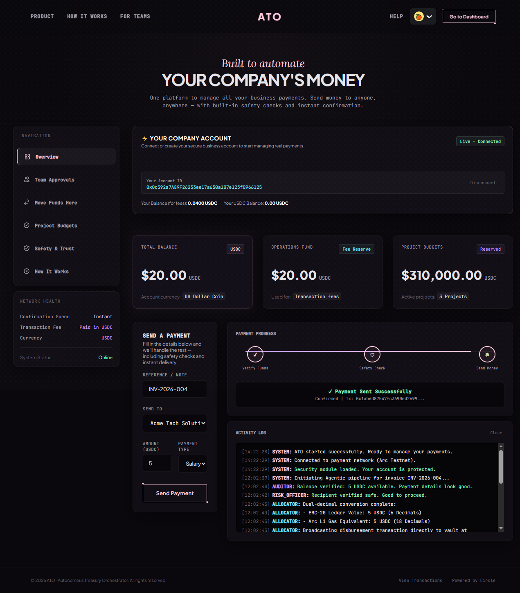
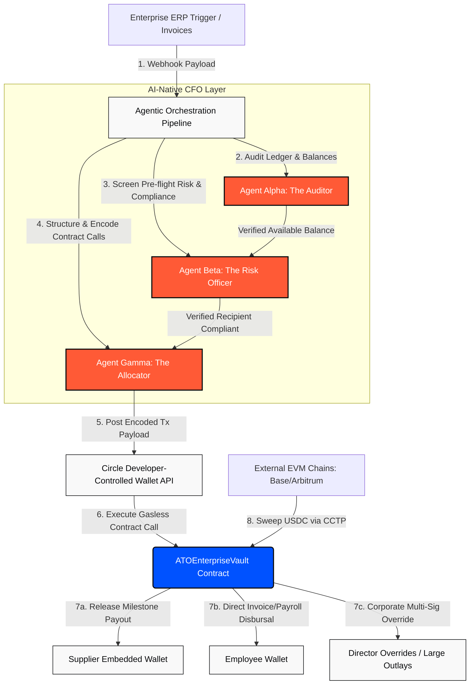
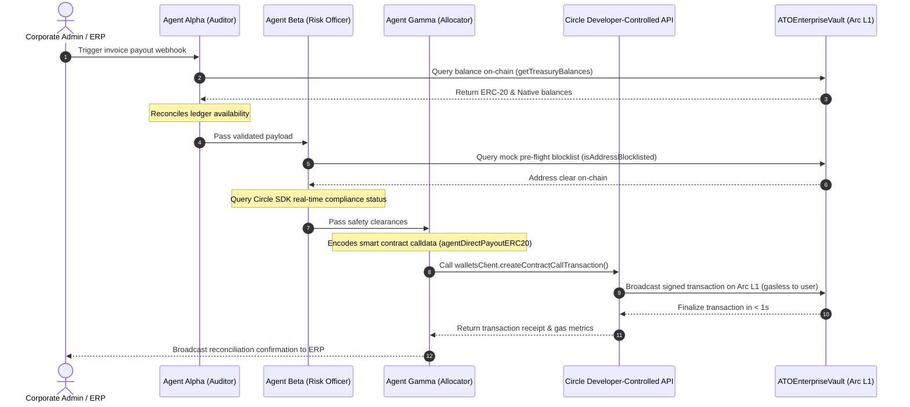
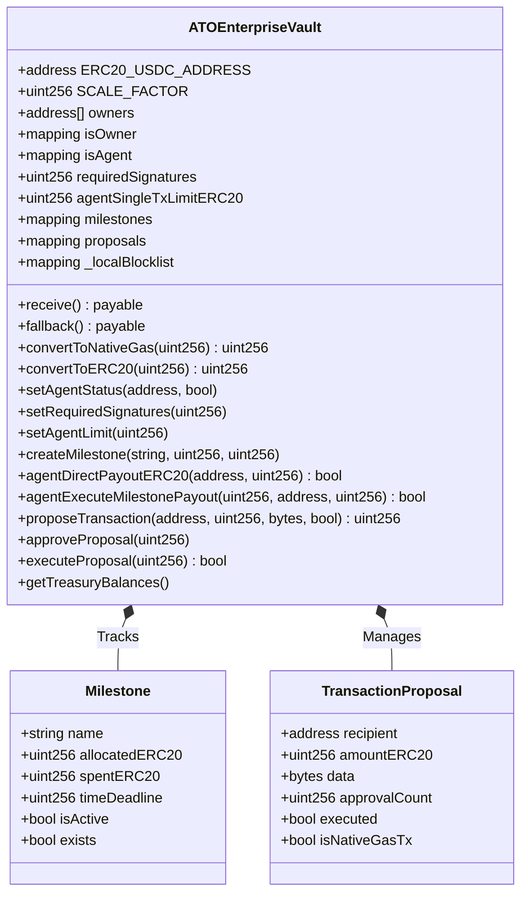

# Autonomous Treasury Orchestrator (ATO) 🏛️

[](https://testnet.arc.network)
[](https://vitejs.dev)
[](https://soliditylang.org)
[](https://www.circle.com)
[](https://wagmi.sh)
[](https://opensource.org/licenses/MIT)

---

### 🎥 [CLICK HERE TO WATCH THE VIDEO DEMO ON GOOGLE DRIVE!](https://drive.google.com/file/d/1HaSJq5NVtEET7uDHvqRKTsJMgw1ujEJl/view?usp=sharing)

---

**Autonomous Treasury Orchestrator (ATO)** is an enterprise-grade, AI-native CFO and Multi-Agent Capital Allocation Operating System running natively on **Circle's Arc L1 Network** (where USDC is the native gas token). 

ATO bridges the massive gap between traditional corporate ERP accounting systems and decentralized ledger operations. By coordinating specialized **cognitive AI agents** with **Circle's Developer-Controlled Programmable Wallets** and highly secure **on-chain escrow vaults**, ATO automates complex corporate financial workflows—including payroll disbursements, milestone-based supplier payments, cross-chain yield sweeping, and multi-signature corporate overrides—with sub-second finality and zero end-user gas friction.

---

## 🖼️ Premium Executive Dashboard & UI Gallery

Below are real screenshots of the **ATO Executive Dashboard** showing the beautiful glassmorphism dark-theme layout, real-time agent logs, CCTP sweepers, and compliance registries:

### 1. Unified Dashboard Overview

*The centralized command center displaying total consolidated balances, real-time operations gas reserve, active milestone counts, and live agent log monitor.*

### 2. Cross-Chain CCTP Sweeper Widget

*The plug-and-play cross-chain portal that lets you sweep USDC from Base Sepolia directly into the corporate Arc L1 treasury vault using Circle's CCTP.*

### 3. Corporate Project Budgets & Milestones

*Enforces strict milestone spending budgets and deadlines, allowing agents to dispatch funds only under strict owner-defined caps.*

### 4. Safety & Trust Compliance Panel

*Pre-flight compliance screener showing dynamic wallet blocklisting registries to proactively protect enterprise assets from freezing risk.*

### 5. Multi-Sig Owner Override Center

*The decentralized multi-signature approval center where directors must sign off on outlays exceeding standard agent limits.*

### 6. Interactive "How It Works" Flow

*Interactive visual guide mapping out the continuous three-agent loop execution from invoice ingestion to L1 settlement.*

---

## 🚀 The Corporate Treasury Crisis vs The Arc/Circle Solution

### 1. The Traditional Treasury & ERP Approval Bottle-Neck
* **Siloed & Fragmented Data**: Traditional ERPs (SAP, NetSuite) operate completely isolated from blockchain states, requiring manual double-entry, excel-based reconciliation, and high operational overhead.
* **Vulnerable to Invoice Fraud**: Financial departments lose billions annually to fraudulent invoice injection or business email compromise (BEC). Manual approval workflows fail to run deep pre-flight static checks or screen for blacklisted recipient endpoints in real-time.
* **Delayed Cross-Border Transactions**: Traditional international corporate wires take **3 to 5 business days** and incur massive intermediary bank fees, paralyzing global logistics and decentralized supply chains.
* **Complex Multi-Sig Friction**: Web3 multi-sig wallets (e.g., Gnosis Safe) are fantastic for security but terrible for automation. Forcing busy corporate directors to manually sign every low-value invoice or recurring payroll gas payment blocks operations.

### 2. The Arc L1 and Circle SDK Architectural Solution
* **Autonomous Cognitive Layer**: Introduces three specialized off-chain AI agents (**Auditor**, **Risk Officer**, **Allocator**) that act as automated corporate delegates, evaluating, auditing, and executing payments within strict, owner-defined policies.
* **Circle Developer-Controlled Wallets**: Leverages high-security programmatic wallets to trigger gasless contract executions automatically, eliminating manual transaction signing for standard operational outlays.
* **Circle CCTP Cross-Chain Sweeper**: Allows corporations to automatically sweep dormant USDC balances from alternative chains (like Base or Arbitrum Sepolia) directly into their Arc L1 treasury vault via **Circle's Cross-Chain Transfer Protocol (CCTP)**.
* **Dual-Decimal Conversion Engine**: Natively handles the math conversion between Arc L1's native Gas USDC (18 decimals) and standard ERC-20 USDC (6 decimals) in a single unified ledger, preventing rounding anomalies.

---

## 🏛️ System Architecture & Workflow Blueprints (Mermaid)

ATO is built on a robust **Hybrid Web3 Architecture** that separates high-frequency cognitive audits from immutable on-chain ledger actions.

### 1. High-Level System Architecture



> [!NOTE]
> **Architecture Overview:**
> 1. Invoices are ingested from ERP hooks or enterprise triggers.
> 2. **Agent Alpha (Auditor)** checks the vault's balance on-chain to reconcile availability.
> 3. **Agent Beta (Risk Officer)** performs a dual compliance check, querying both Circle's compliance risk APIs and the vault's on-chain static blocklist to prevent locked funds.
> 4. **Agent Gamma (Allocator)** structures the transaction payload and sends it to the Circle SDK.
> 5. Circle's **Developer-Controlled Wallets** execute the transaction, triggering the `ATOEnterpriseVault.sol` smart contract on Arc Testnet, releasing standard payrolls, milestone funds, or logging multi-sig override requests.

### 2. Agentic Orchestration Pipeline & Circle API Sequence Flow



> [!IMPORTANT]
> **Pre-Flight Compliance Security Strategy:**
> Standard EVM execution fails and wastes gas if an address is blocklisted by stablecoin issuers. To protect enterprise systems from transaction stalls, Agent Beta executes a mock static call against `ATOEnterpriseVault`'s on-chain blacklist mapping (`isAddressBlocklisted`) and cross-checks with Circle's external compliance engine *before* initiating the mempool broadcast.

### 3. Circle CCTP Sweeper Cross-Chain Bridge Flow

Corporate treasurers can sweep capital across multiple chains to aggregate funds on Arc L1's low-fee environment.

```mermaid
graph LR
    classDef main fill:#FF5A36,stroke:#090A0C,stroke-width:2px,color:#fff;
    classDef tech fill:#f9f9f9,stroke:#090A0C,stroke-width:1px,color:#090A0C;
    classDef contract fill:#0052FF,stroke:#090A0C,stroke-width:2px,color:#fff;

    A[Director / CFO] -->|1. Trigger Cross-chain Sweep| B[Base / Arbitrum Sepolia]:::tech
    B -->|2. approve USDC spending| C[Circle TokenMessenger Contract]:::contract
    B -->|3. depositForBurn USDC| C
    C -->|4. Emit Burn Event| D[Circle CCTP Attestation Service]:::main
    D -->|5. Cryptographic Attestation| E[Arc L1 TokenMessenger Mint]:::contract
    E -->|6. Mint directly into Escrow| F(ATOEnterpriseVault Contract):::contract
```



> [!TIP]
> **Cross-Chain Treasury Optimization:**
> ATO automatically formats the destination recipient address during CCTP `depositForBurn` as a padded 32-byte representation of the corporate `ATOEnterpriseVault` contract address. Once Circle’s attestation is validated on Arc L1, the newly minted USDC lands directly in the corporate vault, immediately ready for multi-agent allocation.

### 4. Smart Contract State & Modifier Map (Class Diagram)



---

## 🛠️ 4 Core Features

### 1. Enterprise Multi-Agent Controller
ATO implements a specialized three-agent cognitive orchestrator written in TypeScript and integrated with the Circle SDK:
* **Agent Alpha (The Auditor):** Reconciles incoming ERP hooks with on-chain vault ledger status. It calculates fund availability and ensures allocation safety boundaries.
* **Agent Beta (The Risk Officer):** A pre-flight compliance guard. It cross-checks recipient addresses against on-chain blocklists and Circle APIs to proactively mitigate stablecoin freezing risks.
* **Agent Gamma (The Allocator):** Formats EVM transactions, calculates optimal fee levels, structures contract arguments, and uses Circle's Developer-Controlled Wallets to execute contract disbursements asynchronously and gas-free for the end receiver.

### 2. Dual-Decimal Vault Escrow Engine (`ATOEnterpriseVault.sol`)
On Arc L1, Native Gas USDC uses **18 decimals**, whereas standard ERC-20 USDC uses **6 decimals**. The `ATOEnterpriseVault` contract implements highly secure scaling logic to avoid floating-point math issues and maintain clean balance sheets:
* **Precision Math Scaling:**
  ```solidity
  uint256 public constant SCALE_FACTOR = 10 ** 12; // 10^18 / 10^6
  
  function convertToNativeGas(uint256 erc20Amount) public pure returns (uint256) {
      return erc20Amount * SCALE_FACTOR;
  }
  
  function convertToERC20(uint256 nativeGasAmount) public pure returns (uint256) {
      return nativeGasAmount / SCALE_FACTOR;
  }
  ```

### 3. Dynamic Corporate Milestone Allocations
* Directors can pre-allocate corporate budgets to specific milestones (e.g., `"Q3 Frontend R&D"` or `"Cross-Border Logistics Payroll"`) with strict deadlines.
* Registered AI agents can release payments directly from these active milestones, but the contract strictly guarantees that expenditures cannot exceed the milestone budget cap, securing corporate capital from rogue agent execution.

### 4. Multi-Signature Emergency Corporate Overrides
* For outlays that exceed the single-agent transaction limit (`agentSingleTxLimitERC20`) or require Native Gas rebalancing, the system triggers a secure, on-chain multi-signature proposal flow.
* Transaction proposals must gather a minimum number of director approvals (`requiredSignatures`) before the smart contract permits execution, providing the ultimate fallback security layer for the enterprise.

---

## 🏛️ Business Model & Commercial Viability

ATO is positioned to capture a highly lucrative share of the enterprise treasury and global supply chain market:

1. **Enterprise SaaS Licensing**: Charges Web3-native companies, DAOs, and traditional SMEs a flat recurring monthly subscription fee for the SaaS dashboard and real-time ERP (SAP/NetSuite) integrations.
2. **Allocation Fee (Micro-payment scaling)**: Captures a tiny fraction (**0.1%**) on direct payouts and milestone payouts managed by our AI agent network.
3. **Cross-Chain Bridging Utility Fee**: Charges a minimal service fee for automated cross-chain sweeps utilizing our CCTP Sweeper pipeline, optimized to capture the best gas rates across EVM ecosystems.

---

## 📂 Project Directory Structure

```bash
ATO/
├── contracts/
│   └── ATOEnterpriseVault.sol   # Enterprise smart treasury vault, supporting dual-decimal & milestones
├── scripts/
│   ├── deploy.ts                # Deploys the ATOEnterpriseVault with owner configurations
│   └── agentController.ts       # Multi-agent (Auditor, Risk Officer, Allocator) Circle SDK controller
├── frontend/
│   ├── src/
│   │   ├── App.tsx              # Rich premium SaaS executive dashboard with real-time UI
│   │   ├── contractBytecode.ts  # Pre-compiled ABI and bytecode mappings for easy factory deploys
│   │   ├── index.css            # Custom styled styling definitions
│   │   └── main.tsx             # Setup for RainbowKit, Wagmi, and Arc Network providers
│   ├── package.json
│   └── vite.config.ts
├── hardhat.config.ts            # Hardhat setup targeting Arc Testnet natively
├── package.json
└── tsconfig.json
```

---

## 🛠️ Quickstart & Local Development Setup

### 1. Prerequisites
* Node.js >= 18.0.0
* npm or yarn package manager
* An EVM wallet (MetaMask) configured to connect to **Arc Testnet**

### 2. Local Installation

```bash
# 1. Clone the project and navigate to the directory
cd ATO

# 2. Install root dependencies (Hardhat environment)
npm install

# 3. Install frontend dependencies
cd frontend
npm install
cd ..
```

### 3. Environment Configurations
Create a `.env` file in the `ATO` root directory and populate with your credentials:
```env
ARC_TESTNET_RPC_URL=https://rpc.testnet.arc.network
PRIVATE_KEY=your_hardhat_deployer_wallet_private_key
CIRCLE_API_KEY=sandbox_your_circle_api_key
CIRCLE_ENTITY_SECRET=your_32_byte_hexadecimal_entity_secret
CIRCLE_WALLET_ID=your_developer_controlled_wallet_uuid
VAULT_CONTRACT_ADDRESS=your_deployed_vault_contract_address
```

### 3.5. Initializing Circle Developer-Controlled Wallets

Use our helper script `scripts/circleWallets.ts` to quickly query, create wallet sets, and generate new developer-controlled wallets on Circle's platform:

1. **List Existing Wallet Sets & Wallets:**
   ```bash
   npx ts-node scripts/circleWallets.ts list
   ```
   *Console Output:*
   ```text
   Listing Wallet Sets...
   =================== WALLET SETS ===================
   {
     "walletSets": []
   }

   Listing Wallets...
   ===================== WALLETS =====================
   {
     "wallets": []
   }
   ===================================================
   ```

2. **Create a New Wallet Set:**
   ```bash
   npx ts-node scripts/circleWallets.ts create-set
   ```
   *Console Output:*
   ```text
   Creating Wallet Set with name: "ATO Wallet Set"...
   =================== WALLET SET CREATED ===================
   {
     "walletSet": {
       "id": "3b3664e2-ea95-5072-b6e5-a06d3bfe2d95", 
       "custodyType": "DEVELOPER",
       "name": "ATO Wallet Set",
       "updateDate": "2026-05-25T04:28:29Z",
       "createDate": "2026-05-25T04:28:29Z"
     }
   }
   =========================================================    

   Next, you can create a wallet in this set using:
   npx ts-node scripts/circleWallets.ts create-wallet 3b3664e2-ea95-5072-b6e5-a06d3bfe2d95
   ```

3. **Generate a Developer-Controlled Wallet:**
   ```bash
   npx ts-node scripts/circleWallets.ts create-wallet 3b3664e2-ea95-5072-b6e5-a06d3bfe2d95
   ```
   *Console Output:*
   ```text
   Creating Developer-Controlled Wallet in set 3b3664e2-ea95-5072-b6e5-a06d3bfe2d95...
   =================== WALLET CREATED ===================       
   {
     "wallets": [
       {
         "id": "52c76c04-251f-5d24-8895-f05017b993b8",
         "state": "LIVE",
         "walletSetId": "3b3664e2-ea95-5072-b6e5-a06d3bfe2d95", 
         "custodyType": "DEVELOPER",
         "address": "0xa7952c334139e7f82a2a7dd499acee1547b78bd6",
         "blockchain": "ETH-SEPOLIA",
         "accountType": "EOA",
         "updateDate": "2026-05-25T04:28:50Z",
         "createDate": "2026-05-25T04:28:50Z"
       }
     ]
   }
   ======================================================       

   Update your .env file with:
   CIRCLE_WALLET_ID=52c76c04-251f-5d24-8895-f05017b993b8  
   ```

### 4. Smart Contract Compilation & Deployment

```bash
# Compile contracts and generate TypeScript types
npx hardhat compile

# Deploy contract directly to Arc Testnet
npx hardhat run scripts/deploy.ts --network arcTestnet
```

### 5. Running the AI Multi-Agent Controller

To run the multi-agent auditor and executor against your deployed vault:
```bash
npx ts-node scripts/agentController.ts
```

### 6. Running the SaaS Dashboard Frontend

```bash
cd frontend
npm run dev
```
Open [http://localhost:5173](http://localhost:5173) in your browser to interact with the treasury control panel.

---

## 🔒 Security & Optimization Shield

* **Strict Gated Roles:** Direct payout calls (`agentDirectPayoutERC20` and `agentExecuteMilestonePayout`) are heavily guarded by `onlyAgentOrOwner` modifiers. Any unauthorized caller is instantly rejected on-chain.
* **EVM-Level Blocklist Defense:** Pre-flight compliance checks are supported by an on-chain blocklist mapping in `ATOEnterpriseVault.sol`. If an address is blocklisted, the modifier `complianceCheck` reverts the transaction before standard execution.
* **Circle Developer Wallets Safeguard:** Entity secrets are securely processed inside the backend Node.js cognitive server (`scripts/agentController.ts`) or Circle's console environment, keeping private keys shielded.
* **Frictionless L1 Native Gas Scaling:** All native gas transactions are represented in standard corporate ledgers as 6-decimals USDC. When executed, the scaling factors automatically translate values to 18-decimals Native USDC Gas, ensuring flawless settlement on Arc Network.

